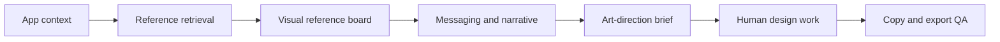

<div align="center">

# Niceapps Creative Studio

**Turn App Store inspiration into an evidence-backed screenshot brief.**

[](https://www.npmjs.com/package/niceapps-creative-studio)
[](https://github.com/ilyastorunn/niceapps-creative-studio/actions/workflows/ci.yml)
[](LICENSE)

[Install](#install) · [How it works](#how-it-works) · [Tools](#tools) · [Limitations](#honest-limitations)

</div>

Niceapps Creative Studio is an analysis-first MCP server for developers preparing App Store screenshots. It studies your app alongside human-reviewed campaigns from [niceapps.club](https://niceapps.club), then helps an AI agent produce a clearer story, stronger copy, and a concrete art-direction brief.

It does **not** generate finished marketing artwork. The first public version is deliberately focused on the part it can do reliably: research, reasoning, critique, and measurable QA.

## Why this exists

“Make screenshots like this app” is a weak creative brief. It encourages imitation, generic templates, and unexplained design choices.

Creative Studio gives the agent better evidence:

- relevant screenshot references, selected at frame level rather than by category alone;
- the actual reference images in a visual comparison board;
- an explanation of why each reference is useful;
- a screen-by-screen narrative, copy, and source-screen plan;
- art direction described as hierarchy, crop, material, typography, composition, and image-making method;
- memory for rejected directions so the next proposal changes meaningfully;
- copy-fit and export checks that remain separate from subjective design review.

## Install

Requires Node.js 20 or newer and any MCP-compatible client.

### OpenAI Codex

```bash
codex mcp add niceapps-creative-studio -- npx -y niceapps-creative-studio@latest
```

Or install the Codex plugin to load both the MCP server and the screenshot-planning skill:

```bash
codex plugin marketplace add ilyastorunn/niceapps-creative-studio --ref main
codex plugin add niceapps-creative-studio@niceapps
```

### Claude Code

```bash
claude mcp add --scope user niceapps-creative-studio -- npx -y niceapps-creative-studio@latest
```

### Claude Desktop, Cursor, and Windsurf

Add this server to your client's MCP JSON configuration:

```json
{
  "mcpServers": {
    "niceapps-creative-studio": {
      "command": "npx",
      "args": ["-y", "niceapps-creative-studio@latest"]
    }
  }
}
```

Common configuration locations:

| Client | Configuration |
| --- | --- |
| Claude Desktop | `~/Library/Application Support/Claude/claude_desktop_config.json` on macOS |
| Cursor | `~/.cursor/mcp.json` for user scope or `.cursor/mcp.json` for project scope |
| Windsurf | `~/.codeium/windsurf/mcp_config.json` |

On Windows, use `"command": "cmd"` and begin the arguments with `"/c", "npx"`.

### VS Code

Add `.vscode/mcp.json` to a workspace, or use the corresponding user-level MCP configuration:

```json
{
  "servers": {
    "niceapps-creative-studio": {
      "type": "stdio",
      "command": "npx",
      "args": ["-y", "niceapps-creative-studio@latest"]
    }
  }
}
```

### Gemini CLI

Add the server to `~/.gemini/settings.json`:

```json
{
  "mcpServers": {
    "niceapps-creative-studio": {
      "command": "npx",
      "args": ["-y", "niceapps-creative-studio@latest"]
    }
  }
}
```

### Any stdio MCP client

Run the package through `npx` and configure the client to communicate over standard input/output:

```bash
npx -y niceapps-creative-studio@latest
```

The server writes protocol messages to stdout, so launching it directly may appear to do nothing. That is expected; normally an MCP client starts and controls the process.

Restart the client or begin a new conversation after installation so it discovers the tools.

## Try it

Give the agent an App Store URL, product brief, or a set of current screenshots:

> Analyze this app and plan a five-frame App Store screenshot story. Find visually and rhetorically relevant Niceapps references, show me the reference board, explain what is worth borrowing, and propose the messaging, source screen, composition, and art direction for every frame. Do not generate final artwork.

For critique:

> Review my current screenshot set against the product promise and the selected references. Separate messaging, narrative, visual-system, copy-fit, and technical-export problems. Prioritize the three changes with the highest impact.

For a rejected direction:

> I rejected this direction because it feels like a generic gradient template. Record that feedback and define two replacements that change both the image-making method and composition system—not just the palette.

## How it works



The catalog currently contains 92 human-reviewed frames across 11 apps. Retrieval considers communication job, headline pattern, product language, visual style, composition, background, and device treatment. Results include match reasons and can exclude the target app or cap repeated results from one campaign.

Annotations are an index, not a substitute for sight. `get_reference_board` returns the selected screenshots as an image so the agent must inspect the actual hierarchy, crop, lighting, material, typography, collage, and product scale before proposing a direction.

## What you get

A useful response should include:

1. A normalized product brief with unknowns marked explicitly.
2. A small reference set split into product, visual, and communication relevance.
3. A positioning statement and the primary audience.
4. An ordered screenshot story with one job per frame.
5. Draft headline and supporting copy for each locale.
6. The real in-app screen or state needed for every frame.
7. A concrete art-direction brief tied to visible reference evidence.
8. Risks, unsupported claims, and the next decisions a human designer must make.

## Tools

| Area | Tool | What it does |
| --- | --- | --- |
| Catalog | `search_apps` | Searches the public niceapps.club catalog. |
| Catalog | `get_app` | Returns one app and its screenshot URLs. |
| Research | `search_screenshots` | Finds reviewed frame-level patterns and explains every match. |
| Research | `get_screenshot_set` | Returns a reviewed campaign in storefront order. |
| Research | `get_reference_board` | Returns selected real screenshots as an image for visual inspection. |
| Context | `import_app_store` | Imports public App Store metadata and current screenshots. |
| Iteration | `record_direction_feedback` | Stores why a direction was rejected and what must change or remain. |
| Iteration | `compare_direction_previews` | Checks whether externally created alternatives are materially different. |
| QA | `validate_screenshot_copy` | Measures localized copy against the target canvas in pixels. |
| QA | `validate_screenshot_set` | Checks existing exports for dimensions, format, opacity, and ordering. |

The two QA tools validate measurable facts. They do not certify visual quality or predict conversion performance.

## Design principles

- **Evidence before aesthetics.** Every recommendation points back to the app, a visible reference, or a stated product constraint.
- **References are not templates.** The server extracts principles; it does not reproduce another campaign.
- **Real gaps stay visible.** Weak catalog coverage is reported instead of forcing an unrelated match.
- **Rejection changes the system.** A replacement must alter image-making method and composition, not merely color or decoration.
- **Human judgment remains the final gate.** Technical validity and creative acceptance are different questions.

## Privacy and writes

- Catalog and App Store lookups use public data.
- The server does not upload screenshots, edit your app, or publish to App Store Connect.
- No API key is required for the default public catalog.
- Direction feedback and optional comparison boards are written only when you provide an explicit local path beneath the current project or operating-system temporary directory.
- Set `NICEAPPS_API_URL` only if you want to use a different catalog API origin. The default is `https://api.niceapps.club`.

## Honest limitations

- The reviewed catalog is intentionally small and will not cover every product or visual language.
- Reference relevance is explainable lexical retrieval plus human-authored annotations, not proof of conversion lift.
- The MCP can critique and specify art direction, but it cannot replace a strong graphic designer or produce finished App Store artwork.
- Copy measurement currently targets the supported `1290 × 2796` iPhone canvas and local font fallbacks can vary by operating system.
- Cross-platform behavior beyond the current macOS verification remains incomplete.

## Development

```bash
git clone https://github.com/ilyastorunn/niceapps-creative-studio.git
cd niceapps-creative-studio
npm install
npm test
npm run eval:retrieval
npm pack --dry-run
```

To inspect the server interactively:

```bash
npx -y @modelcontextprotocol/inspector npx -y niceapps-creative-studio@latest
```

See the [changelog](CHANGELOG.md), [contribution guide](CONTRIBUTING.md), [security policy](SECURITY.md), and [architecture notes](docs/architecture.md).

## Status and roadmap

Creative Studio is an early public preview. The next milestones are broader reviewed reference coverage, stronger critique evaluations, and additional copy-measurement targets.

Image generation is not on the first-version roadmap. It should return only after repeatable evaluation shows that it improves on a designer-ready brief.

## License

MIT © niceapps.club contributors
